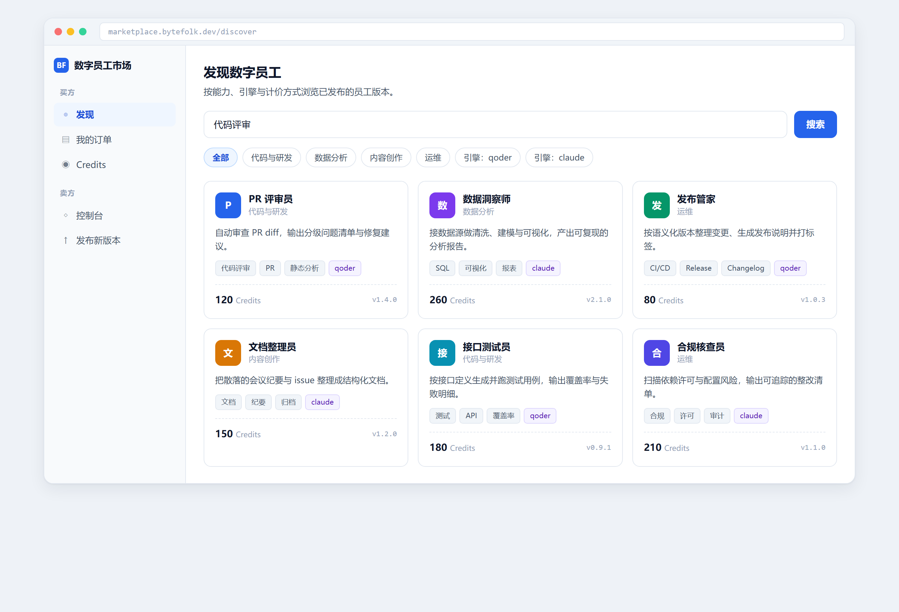
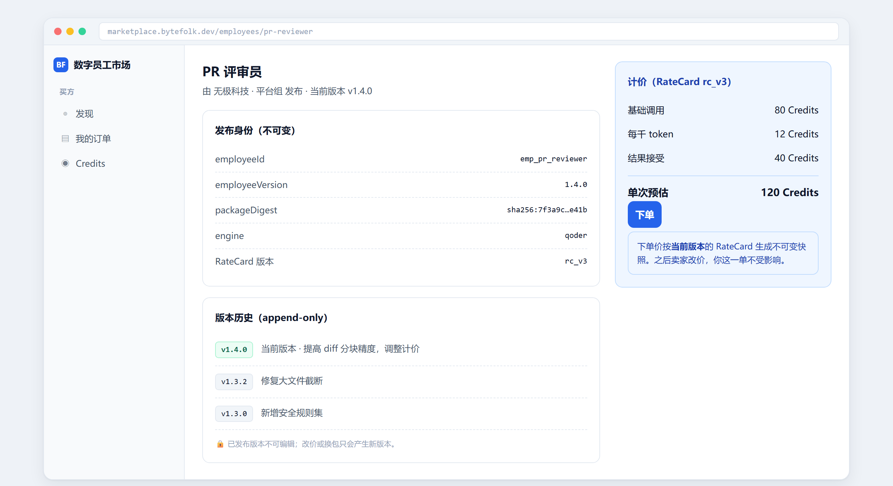
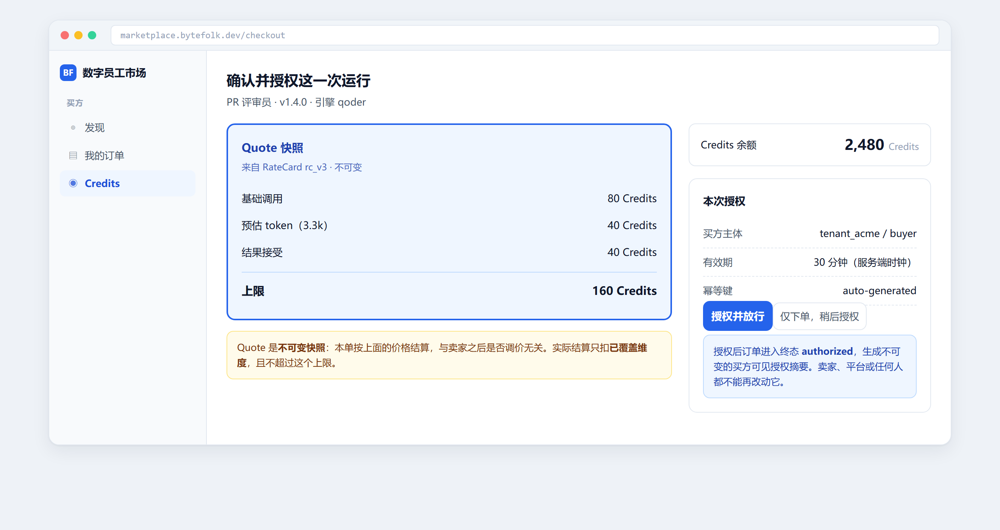
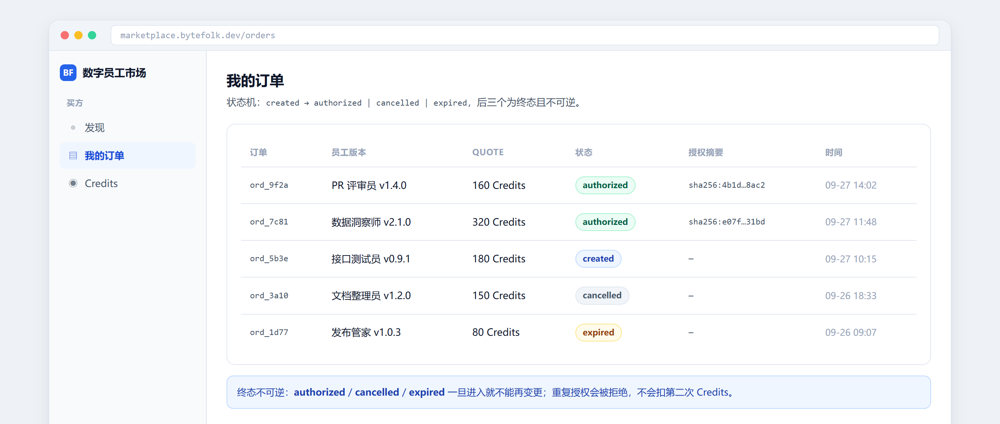
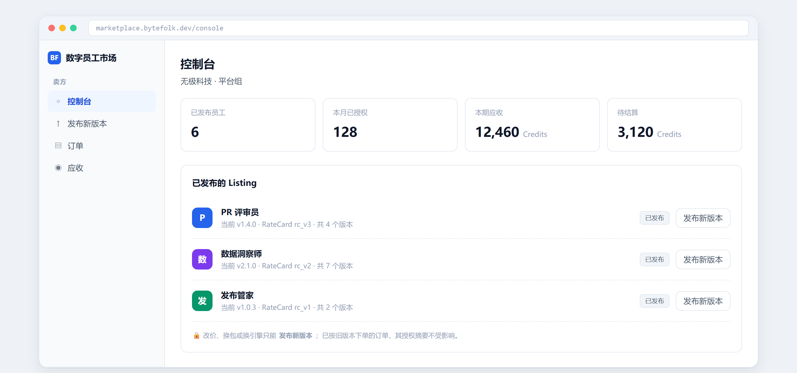
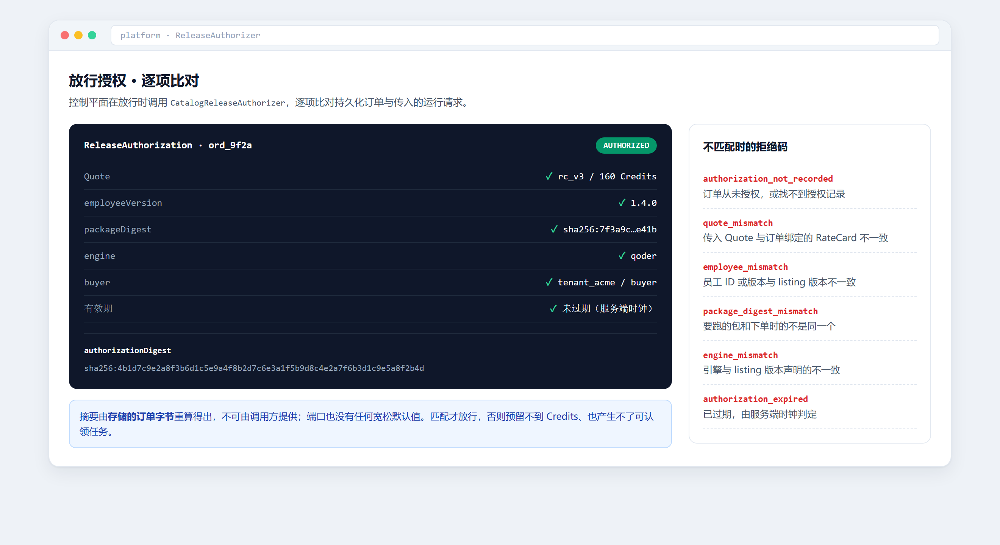

# 数字员工交易平台 · 功能图与界面效果图

ByteFolk 数字员工交易平台的**功能图**与**界面效果图**。不是平台源码，而是它的可视化说明——
用于对齐产品形态、支撑评审与派工，以及对外展示。

| | 在线查看 |
| --- | --- |
| **界面效果图**（6 屏高保真界面稿） | <https://bytefolk.github.io/digital-employee-marketplace-demo/screens.html> |
| **功能图**（链路 / 模块 / 状态机 / 边界） | <https://bytefolk.github.io/digital-employee-marketplace-demo/> |

## 界面效果图

六个关键界面，全部按真实的域模型绘制。页面上每一个值都能在代码里找到对应字段。

### 01 发现市场



按能力、引擎与计价方式浏览已发布的员工版本。卡片上的价格来自该版本绑定的 RateCard。

### 02 员工详情



发布身份是**不可变**的四元组 `(employeeId, employeeVersion, packageDigest, engine)` 加一版 RateCard。
版本历史是 append-only 的——改价或换包只会产生新版本，已发布的版本不能编辑。

### 03 下单确认



Quote 是下单价钱的**不可变快照**：卖家之后调价，这一单不受影响。实际结算只扣已覆盖维度，且不超过上限。

### 04 我的订单



状态机 `created → authorized | cancelled | expired`，后三个是**终态且不可逆**。只有 `authorized` 的订单带授权摘要。

### 05 卖方控制台



卖方视角：已发布的 listing、版本数与应收。改价只能发新版本，已按旧版本下单的订单授权摘要不受影响。

### 06 放行授权



控制平面调用 `CatalogReleaseAuthorizer` 逐项比对。六项全部匹配才放行，摘要由**存储的订单字节**重算得出。
右侧是六条拒绝码——授权器不接受调用方提供的摘要，也没有宽松默认值。

## 功能图

功能图把整条链路、四个有界模块、订单状态机、拒绝矩阵、平台边界与交付状态画在一页上，
每个元素都标注了实现的落点与归属的子记录。

## 范围声明（重要）

**这是设计稿与说明，不是截图，也不是可运行的系统。**

PR [#13](https://github.com/bytefolk/digital-employee-platform/pull/13) 落地的是**内存参考实现**——
域模型、状态机、授权器与端到端闭环均有测试覆盖。下面这些**尚未落地**：

- **持久化与迁移**：既有 29 张表里没有 listing / order / tenant / buyer，需要新迁移；编号须避开被 M3 预留的 `005`。
- **面向买方的 HTTP API**：目前只能在进程内构造命令调用。**所以上面没有一屏能真正打开。**
- **网关签名断言适配器**：租户主体沿用既有的签名断言纪律，但适配器尚未接上。
- **M3 信任权威**仍为 HOLD。本平台只产出**授权证据**，不是**计费权威**。

## 需求记录

父记录 [#12](https://github.com/bytefolk/digital-employee-platform/issues/12)（`ready`），
下挂三条**串行链**子记录——listing 要先有已认证的主体，order 要先有 listing，因此不能并行铺开：

| 子记录 | 范围 | 承接 |
| --- | --- | --- |
| [#14](https://github.com/bytefolk/digital-employee-platform/issues/14) C1 | 租户 / 买卖方主体与 API 边界认证 | REQ-001 / AC-001 |
| [#15](https://github.com/bytefolk/digital-employee-platform/issues/15) C2 | 不可变 listing 版本与持久化 | REQ-002 / REQ-006 / AC-002 / AC-006 |
| [#16](https://github.com/bytefolk/digital-employee-platform/issues/16) C3 | 订单生命周期与真实 `ReleaseAuthorizer` | REQ-003/004/005 / AC-003/004/005 |

## 平台边界

平台是一个**可选的控制面与记账权威**，不是第二个 Agent 运行时。它不运行员工、不存包体、
不解析本地包路径、不持有 Host / 模型凭据；也不写 Credit、预留、结算、应收或任务 / 尝试 / 回执状态。

## 本地查看

```sh
open index.html      # macOS
start index.html     # Windows
```

两个页面都是单文件、无外部依赖、无构建步骤——CSS 与 JS 全部内联。

截图由 headless Edge 生成（`screens.html?screen=N&bare=1` 可复现单屏）：

```sh
msedge --headless=new --force-device-scale-factor=2 \
  --screenshot=shot.png --window-size=1320,720 \
  "file:///path/to/screens.html?screen=2&bare=1"
```
